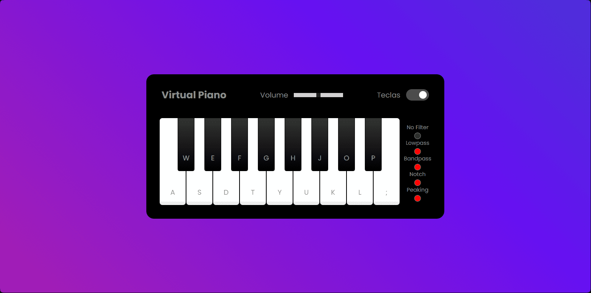

<h1 align="center">js-piano</h1>

## 📲 View the project here
<a href="https://devgustavus.github.io/js-piano/">https://devgustavus.github.io/js-piano/</a>

## 📖 About the project
Project developed as part of a code/project challenge at DIO, as part of the BootCamp: "Potência Tech iFood - Game Development". <br>
The project was based on a virtual piano, whose keyboard has several keys capable of producing different sounds. Not only that, but the keyboard also has a volume control, an option to show or hide the piano key guidance corresponding to the PC keyboard keys. Furthermore, it also includes options for filters/equalizers. The project is responsive for mobile devices and utilizes the Web Audio API to implement the equalizers.

### Main page


## 🦾 Technologies used
<div style="display: flex;">
  


</div>

## 🤔 What i learned
- I learned how to build small game engines.
- I learned to standardize functions according to the game engine.
- I improved user interaction with web elements.
- I enhanced the dynamism of the web page as the project is centered around a game.
- I was able to improve my audio manipulation skills.

## 👽 How to clone this project

````bash
    # Select where you want to clone
    $ cd ~/Documents/WHERE_YOU_WANT
````

````bash
    # Clone the project
    $ git clone https://github.com/DevGustavus/REPOSITORY_NAME.git
````

````bash
    # Check if cloning worked fine
    $ cd ~/Documents/DIRECTORY_LOCATION
    $ ls
````
